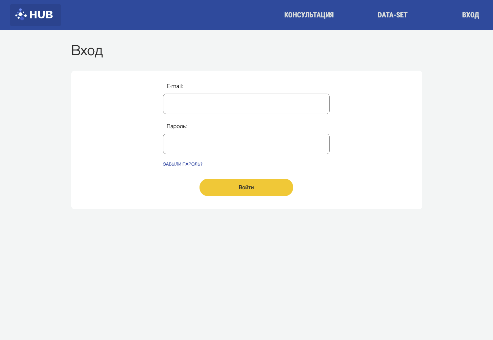
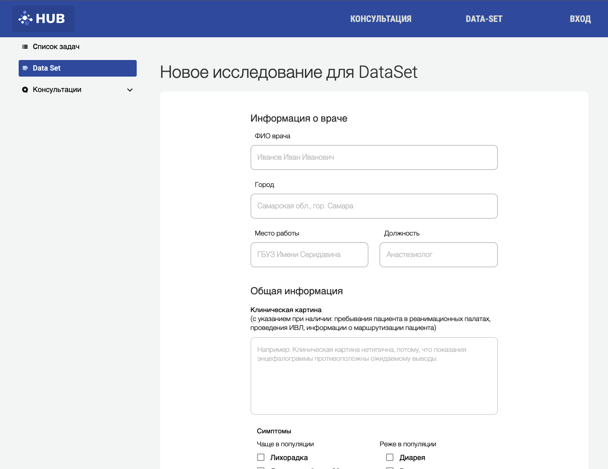
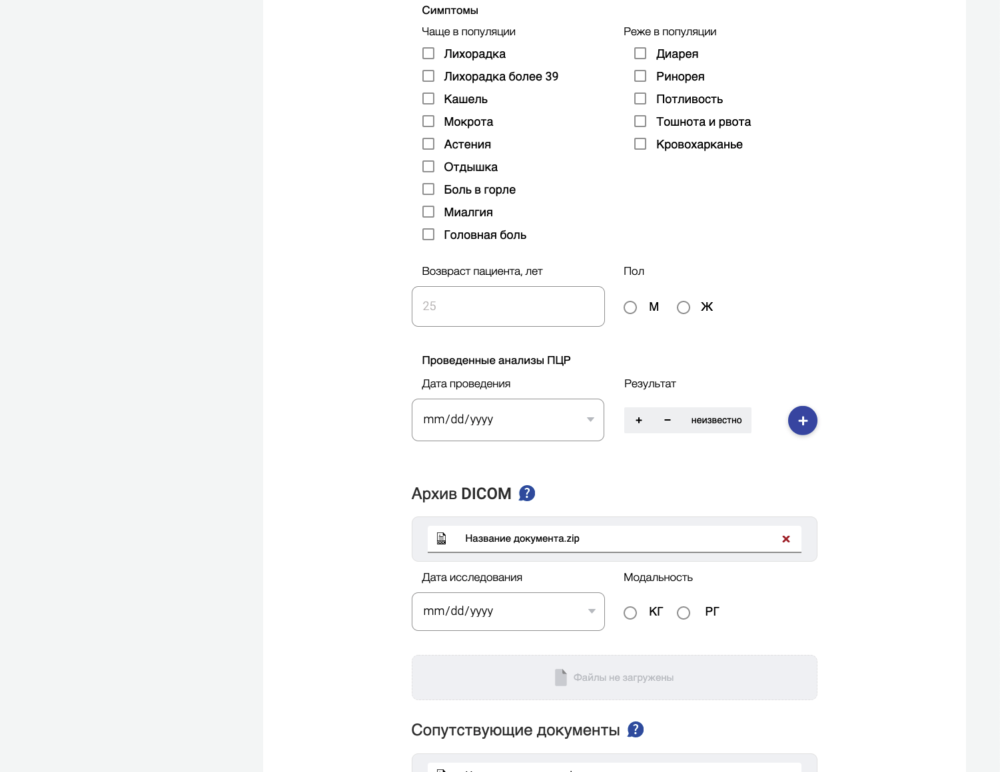
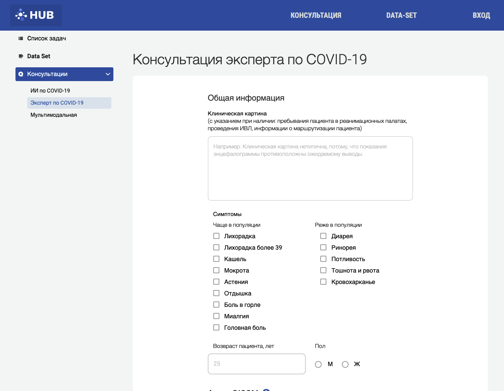
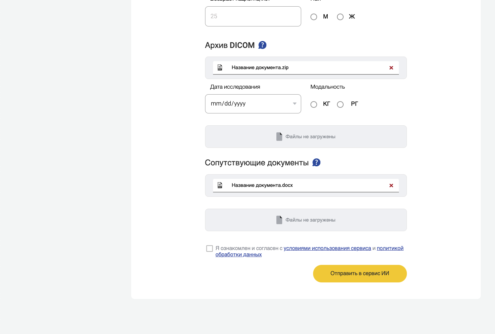
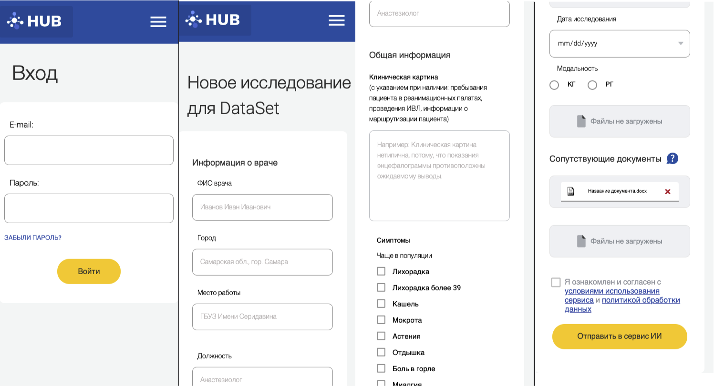

# Web service

Collaborated with a medical organization during the onset of a global pandemic
Service for helping doctors when working with Covid19

## Technologies

1. HTML
2. CSS/SASS (Grid, Flex, Bam)
3. Js

## Screenshots

  
  
  
  
  
  
